# 🛡️ Security Documentation

This document provides detailed technical information about Urai Space's security architecture and cryptographic implementation.

---

## 🔐 Zero-Knowledge Architecture

Urai Space implements a **true zero-knowledge architecture**, meaning:

- **All encryption happens client-side** (in your browser)
- **Your password never leaves your device**
- **We cannot decrypt your data** - mathematically impossible without your password
- **No backdoors or master keys** - not even for developers or law enforcement

---

## 🔑 Cryptographic Specifications

### Encryption Algorithm

**AES-256-GCM (Advanced Encryption Standard, 256-bit, Galois/Counter Mode)**

- **Key Size**: 256 bits (32 bytes)
- **Block Size**: 128 bits (16 bytes)
- **Mode**: GCM (provides both confidentiality and authenticity)
- **IV Size**: 96 bits (12 bytes), randomly generated per encryption
- **Tag Size**: 128 bits (provides authentication)

**Why AES-256-GCM?**
- Used by governments and financial institutions worldwide
- NIST approved and FIPS 140-2 compliant
- Provides authenticated encryption (prevents tampering)
- Resistant to all known practical attacks

### Key Derivation

**PBKDF2-SHA256 (Password-Based Key Derivation Function 2)**

- **Algorithm**: PBKDF2 with SHA-256
- **Iterations**: 100,000 (exceeds OWASP recommendations)
- **Salt**: 128-bit cryptographically random salt (unique per user)
- **Output**: Two 256-bit keys (authentication key + encryption key)

**Why PBKDF2?**
- Deliberately slow to prevent brute-force attacks
- 100,000 iterations makes each password attempt computationally expensive
- Unique salt prevents rainbow table attacks

### Random Number Generation

**Cryptographically Secure Random Number Generator (CSPRNG)**

- Uses browser's `crypto.getRandomValues()`
- Provides cryptographically strong random values
- Used for: salts, initialization vectors (IVs), recovery phrases

---

## 🔐 Security in Plain English

Imagine Urai Space as a **physical safe** in your house.

*   **The Safe**: This is your account.
*   **The Key**: This is your Password.
*   **The Backup Key**: This is your 12-Word Recovery Phrase.

**We (Urai Space) build the safe, but we do NOT have a copy of the key.** 
If you lose your key (Password) AND your backup key (Recovery Phrase), the safe stays locked forever. We cannot open it for you, no matter what.

---

## 🏗️ Visual Security Flows

### 1. How Account Creation Works
We scramble your password so only YOU can use it to unlock your data.


### 2. How We Encrypt Your Data
Your notes are turned into "gibberish" *before* they leave your computer.

```mermaid
graph LR
    User[📝 You write a Note]
    Browser[💻 Your Browser]
    Cloud[☁️ Urai Server]

    User -->|Plain Text| Browser
    Browser -->|Encrypts with Master Key| Cipher[🔒 Encrypted Blob]
    Cipher -->|Uploads| Cloud
    
    style User fill:#e1f5fe
    style Browser fill:#fff9c4
    style Cloud fill:#f3e5f5
    style Cipher fill:#ffccbc,stroke:#ff5722,stroke-width:2px
```



### 3. Secure Data Export (JSON Backup)
When you export, we duplicate the decryption process locally so you get a readable file.

```mermaid
sequenceDiagram
    participant User
    participant Browser
    participant Server

    User->>Browser: Request Export + Password
    Browser->>Browser: ✅ Verifies Password (Unwraps Key)
    Browser->>Server: 📥 Request ALL Encrypted Blobs
    Server-->>Browser: Sends Encrypted Data
    
    loop Every Note/Drawing
        Browser->>Browser: 🔓 Decrypts in Memory
    end
    
    Browser->>User: 💾 Saves "urai-backup.json" to Disk
    Note over Browser: Plain text never touches<br/>the Server!
```


📔 Diary → encrypt() → ciphertext
📝 Notes → encrypt() → ciphertext
🏁 Routines → encrypt() → ciphertext

### 4. Account Deletion (The "Nuclear" Option)
Deleting your account destroys the mathematical keys required to read your data.


**Why is this secure?** Even if a hacker had a backup of our database, without the **Salt** and **Keys** (which are unique to you and now deleted), the data is just useless random noise.

---

## 🔢 Mathematical Security

### Key Space

AES-256 has **2²⁵⁶ possible keys**:

```
115,792,089,237,316,195,423,570,985,008,687,907,853,269,984,665,640,564,039,457,584,007,913,129,639,936
```

**Brute Force Analysis:**

| Attack Rate | Time to Break |
|-------------|---------------|
| 1 million keys/sec | 3.67 × 10⁶³ years |
| 1 billion keys/sec | 3.67 × 10⁶⁰ years |
| 1 trillion keys/sec | 3.67 × 10⁵⁷ years |

**For perspective:** The universe is only ~1.38 × 10¹⁰ years old.

### PBKDF2 Protection

With 100,000 iterations:
- Each password attempt takes ~100ms
- Brute forcing a 12-character password with 95 possible characters per position:
  - Attempts needed: 95¹² = 540,360,087,662,636,962,890,625
  - Time at 10 attempts/sec: **1.71 × 10¹⁵ years**

---

## 🚨 Threat Model

### What We Protect Against

✅ **Server Compromise**
- Attacker gains access to database
- **Result:** Only encrypted gibberish obtained (useless without password)

✅ **Network Interception**
- Man-in-the-middle attack on data transmission
- **Result:** Only encrypted data transmitted (TLS provides additional layer)

✅ **Insider Threat**
- Malicious employee/developer
- **Result:** Cannot access data without user's password

✅ **Legal Requests**
- Government/court order to provide data
- **Result:** Can only provide encrypted blobs (mathematically impossible to decrypt)

✅ **Password Reuse Attack**
- User's password leaked from another service
- **Result:** Unique salt prevents rainbow tables; PBKDF2 slows brute force

### What We Cannot Protect Against

❌ **Keylogger/Malware on User Device**
- If user's computer is compromised, attacker can capture password as typed
- **Mitigation:** Use trusted devices, antivirus, keep OS updated

❌ **User Shares Password**
- If user voluntarily gives password to someone
- **Mitigation:** User education about password security

❌ **Weak Password**
- User chooses "password123"
- **Mitigation:** Password strength indicator, recommendations

❌ **Browser Extension Malware**
- Malicious extension reading page content
- **Mitigation:** Use trusted extensions only

❌ **Physical Device Access**
- Someone gains physical access to unlocked device
- **Mitigation:** Lock screen feature, device lock

---

## 🔍 Security Best Practices

### For Users

1. **Use a Strong Password**
   - At least 12 characters
   - Mix of uppercase, lowercase, numbers, symbols
   - Don't reuse passwords from other services

2. **Save Your Recovery Phrase**
   - Write it down on paper
   - Store in multiple secure locations
   - Never share it with anyone

3. **Secure Your Device**
   - Use antivirus software
   - Keep OS and browser updated
   - Don't install untrusted software

4. **Lock Your Session**
   - Use the lock feature when stepping away
   - Enable device screen lock

### For Developers/Auditors

The private code repository contains the full implementation. Key areas to review:

- `/src/lib/crypto.js` - Encryption implementation
- `/src/lib/supabase.js` - Database interaction
- `/src/components/LockScreen.js` - Authentication flow

---

## 🆘 Incident Response

### If You Suspect Your Password Is Compromised

1. Sign in to Urai Space immediately
2. Use password reset with your recovery phrase
3. Choose a new, strong password
4. Your data will be re-encrypted with the new key

### If You Lose Your Recovery Phrase

1. **While still signed in:** Go to settings and view your recovery phrase
2. Write it down immediately
3. Store in multiple secure locations

### If You Lose Both Password AND Recovery Phrase

**Your data cannot be recovered.** This is by design - it's what makes the encryption secure. There is no backdoor or master key.

---

## 📊 Security Audit Status

- **Last Security Review:** 2026-02-11
- **Penetration Testing:** Self-Audit Completed
- **Third-Party Audit:** None

---

## 🔗 References

- [NIST SP 800-38D](https://nvlpubs.nist.gov/nistpubs/Legacy/SP/nistspecialpublication800-38d.pdf) - GCM Specification
- [RFC 8018](https://tools.ietf.org/html/rfc8018) - PBKDF2 Specification
- [OWASP Password Storage](https://cheatsheetseries.owasp.org/cheatsheets/Password_Storage_Cheat_Sheet.html)
- [Web Crypto API](https://www.w3.org/TR/WebCryptoAPI/)

---

## 📧 Reporting Security Vulnerabilities

If you discover a security vulnerability, please email: **security@uraispace.com**

Please do NOT open a public issue for security vulnerabilities.

---

<p align="center">
  🔐 Your privacy is our priority
</p>
